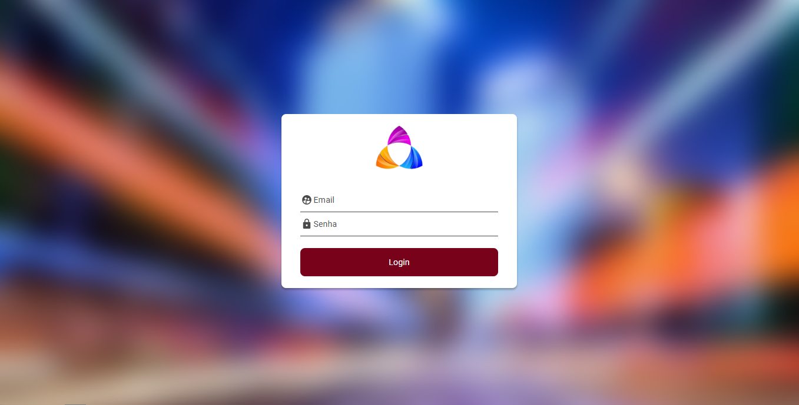
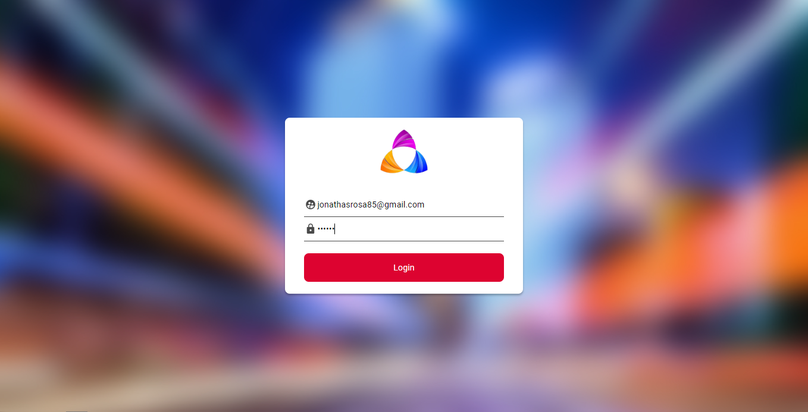
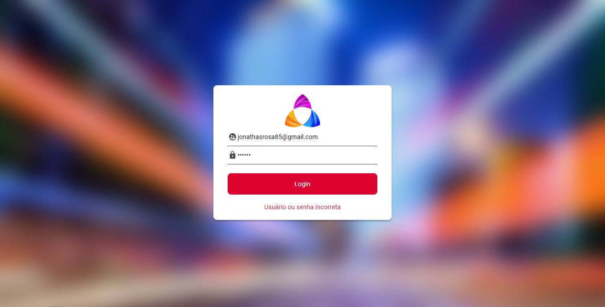

# Login - AuthFront

This project was generated with [Angular CLI](https://github.com/angular/angular-cli) version 13.0.3.

## Development server

Run `ng serve` for a dev server. Navigate to `http://localhost:4200/`. The app will automatically reload if you change any of the source files.

## Code scaffolding

Run `ng generate component component-name` to generate a new component. You can also use `ng generate directive|pipe|service|class|guard|interface|enum|module`.

## Build

Run `ng build` to build the project. The build artifacts will be stored in the `dist/` directory.

## Running unit tests

Run `ng test` to execute the unit tests via [Karma](https://karma-runner.github.io).

## Running end-to-end tests

Run `ng e2e` to execute the end-to-end tests via a platform of your choice. To use this command, you need to first add a package that implements end-to-end testing capabilities.

## Further help

To get more help on the Angular CLI use `ng help` or go check out the [Angular CLI Overview and Command Reference](https://angular.io/cli) page.

## Imagens do Projeto

## Ambiente de Desenvolvimento

O desenvolvimento dessa aplicação foi em HTML5 e CSS3 para fazer a marcação e estilização da base do projeto e Angular com TypeScript para criar a lógica e animações do projeto.
## Histórico de Atualizações

    * Projeto inicial

## 🛠️ O projeto foi construido com

* [HTML5](https://developer.mozilla.org/en-US/docs/Web/HTML) - Estutura do projeto.
* [CSS3](https://developer.mozilla.org/en-US/docs/Web/CSS) - Styles do projeto.
* [Angular](https://angular.io/docs) - criar a interface do projeto.
* [TypeScript](https://www.typescriptlang.org/) - TypeScript para criar a lógica e animações do projeto.

## 📌 Versão

Usei [Git](https://git-scm.com/) para controle de versão. Para as versões disponíveis, observe as [tags neste repositório](https://github.com/JonathasRosa/To-Do).

## ✒️ Autor

* **Um desenvolvedor** - *Trabalho Inicial* - [Jonathas Rosa](https://github.com/JonathasRosa)

## Redes sociais

##
Linkedin - [JonathasRosa](https://www.linkedin.com/in/jonathasrosa85/)
##
Instagram - [@jonathas_rosa85](https://www.instagram.com/jonathas_rosa85/)

## Licença

Distribuído sobre a licença. Veja `MIT License` para mais informações.

[https://github.com/JonathasRosa/To-Do/blob/main/LICENSE](https://github.com/JonathasRosa)

## 🎁 Expressões de gratidão

* Você gosstou do projeto? 
* Conte a outras pessoas sobre este projeto 📢;
* Convide alguém da equipe para uma cerveja 🍺;
* Agradeço publicamente a minha esposa Ingrid Mendez que me incentivou nessa jornada e a todas as outras pessoas que participaram do processo, desde os que me apresentaram a programação e todos os professores;
---
⌨️ com ❤️ por [Jonathas Rosa](https://github.com/JonathasRosa) 😊